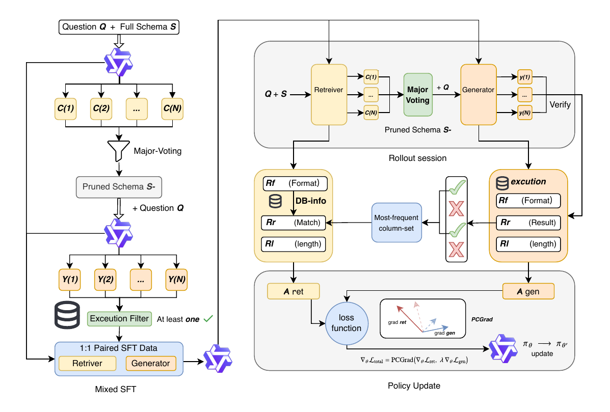

# ACE-SQL

[](https://arxiv.org/abs/2606.05906)
[](LICENSE)

Official repository for **[ACE-SQL: Adaptive Co-Optimization via Empirical Credit Assignment for Text-to-SQL](https://arxiv.org/abs/2606.05906)**.

ACE-SQL is a reinforcement-learning framework for Text-to-SQL over large and complex database schemas. It treats schema retrieval and SQL generation as two roles of a shared LLM policy, then jointly optimizes them with execution feedback. The core idea is to assign credit to schema-retrieval actions from the generator's own execution-correct rollouts, rather than training the retriever only against a fixed gold-column target.

The paper reports **65.3% greedy execution accuracy on BIRD Dev** with **0.93k generated output tokens per query**, using 14,184 supervised fine-tuning samples and 2,913 reinforcement-learning question-database pairs.

<p align="center">
  
  <br>
  <em>Figure 1: Overview of the ACE-SQL framework. Left: self-distillation SFT cold start. Right: joint two-pass GRPO training with empirical credit assignment and PCGrad policy update.</em>
</p>

## Highlights

- **Adaptive retrieval supervision.** ACE-SQL maintains an empirical column-set pool for each question and uses execution-correct generator rollouts to derive on-policy retrieval targets — no gold-column labels needed during RL.
- **Bidirectional retriever-generator adaptation.** The retriever adapts toward column sets the current generator can execute correctly, while the generator adapts to the retriever's evolving schema selections.
- **Stable joint RL.** Dual-role GRPO is stabilized with majority-voted schema selection, an empirical pool with exponential decay, PCGrad gradient projection, and a generator-weight ramp schedule.
- **Efficient inference.** ACE-SQL improves BIRD accuracy while reducing generated output length by 2–3× relative to long-reasoning Text-to-SQL baselines.

## Method Overview

### Two-Pass Architecture

ACE-SQL factorizes Text-to-SQL into two explicit roles handled by the same Qwen3-8B backbone:

1. **Retriever pass:** Given the full database schema and a natural language question, the model selects the minimum necessary tables and columns. The output is a structured column list (e.g., `[table1.col1, table2.col2, ...]`) preceded by `<think>` reasoning.
2. **Generator pass:** Given the pruned schema (only the retrieved columns) and the same question, the model generates executable SQL inside a ` ```sql ``` ` block, also preceded by `<think>` reasoning.

During RL rollouts, the retriever samples N=8 candidate column sets. These are aggregated by **majority voting** (columns appearing in ≥50% of samples) to produce a single stable pruned schema. The generator then samples N=8 SQL candidates conditioned on that pruned schema.

### Training Pipeline

**Stage 1 — Self-Distillation SFT Cold Start.** Qwen3-8B generates its own paired retriever and generator training data via self-consistency voting and execution filtering. This yields 14,184 balanced samples (7,092 retriever + 7,092 generator) used for full-parameter SFT with LLaMA-Factory and DeepSpeed ZeRO-3.

**Stage 2 — Joint GRPO Training.** For each RL example:

1. The retriever role samples 8 column-set candidates.
2. Majority voting produces the pruned schema.
3. The generator role samples 8 SQL candidates against that schema.
4. Each SQL is executed against the database; execution-correct (Match) SQLs are identified.
5. Column sets extracted from Match SQLs update the per-question **empirical column-set pool** with exponential decay (γ = 0.5).
6. The pool's most frequent column set becomes the retriever's target for this step.
7. Both roles receive sparse rewards; the shared model is updated with dual-role GRPO.

### Reward Design

Both roles use **sparse binary rewards** gated by output correctness, plus a shared clipped length penalty.

**Generator reward.** A SQL rollout receives reward 1.0 if its execution result matches the gold answer (Match), and 0.0 otherwise. Match rollouts also receive a length penalty:

```
length_penalty = -0.5 × max(0, (tokens - 512) / (2048 - 512))
```

The penalty is linear from 0 at 512 tokens to -0.5 at 2048 tokens, encouraging concise reasoning. Non-Match rollouts receive no penalty (total reward = 0.0).

**Retriever reward (pool-exact mode).** A retriever rollout receives reward 1.0 if its column set exactly matches any of the highest-frequency entries in the empirical pool for that question, and 0.0 otherwise. Match rollouts also receive the same length penalty. This sparse signal grounds the retriever in what the current generator can actually execute.

### Training Stabilizers

**PCGrad (Projecting Conflicting Gradients).** Because the retriever and generator share all parameters, their gradient updates can conflict. PCGrad detects when the two task gradients point in opposing directions and projects away the conflicting component. The default mode is `symmetric`: both tasks project onto each other. Other supported modes are `generator_dominant` and `norm_equalized`.

**Generator-weight ramp schedule.** The generator loss weight ramps linearly from 0.0 to 1.0 over the first 25% of RL steps, while the retriever weight stays at 1.0 throughout. This lets the retriever establish a useful schema signal before the generator gradient dominates.

**Empirical pool with decay.** Each per-question pool entry stores a frequency count. When new Match column sets are observed, their counts are incremented. At each update, all existing counts are decayed by γ = 0.5, preventing early noisy rollouts from permanently biasing the target.

**Separate advantage normalization.** GRPO advantages are computed and normalized independently for the retriever group and the generator group, preventing one role's reward scale from dominating.

## Main Results

Greedy execution accuracy (%):

| Method | Base Model | BIRD Dev | Spider Dev | Spider Test |
| --- | --- | ---: | ---: | ---: |
| OmniSQL | Qwen2.5-Coder-7B | 63.9 | 81.2 | 87.9 |
| SQL-R1 | Qwen2.5-Coder-7B | 63.7 | 87.6 | 88.7 |
| MTIR-SQL | Qwen3-8B | 63.6 | 83.6 | 83.4 |
| **ACE-SQL** | **Qwen3-8B** | **65.3** | **83.4** | **87.2** |

Inference cost on BIRD Dev:

| Method | BIRD Dev EX | Output Tokens |
| --- | ---: | ---: |
| MAC-SQL + GPT-4 | 59.4 | 2.17k |
| SQL-R1-7B | 63.7 | 3.10k |
| MTIR-SQL-8B | 63.6 | 2.00k |
| ACE-SQL SFT | 63.6 | 1.90k |
| **ACE-SQL SFT + RL** | **65.3** | **0.93k** |

Spider robustness variants (greedy execution accuracy):

| Method | Spider-DK | Spider-Syn | Spider-Realistic |
| --- | ---: | ---: | ---: |
| OmniSQL-7B | **76.1** | 69.7 | 76.2 |
| MTIR-SQL-8B | 72.9 | **77.2** | 77.4 |
| **ACE-SQL** | 74.4 | 73.7 | **79.5** |

### Ablation Study

The ablation shows that each stabilizer contributes to the final result:

| Variant | BIRD Dev | Generator Ability | Retriever Ability |
| --- | ---: | ---: | ---: |
| Qwen3-8B base | 54.2 | 67.9 | 53.1 |
| + SFT | 63.6 | 70.9 | 61.5 |
| + ACE-SQL w/o PCGrad | 63.2 | 69.2 | 60.7 |
| + ACE-SQL w/o schedule | 64.5 | 71.3 | 63.9 |
| **+ ACE-SQL full** | **65.3** | **72.9** | **64.2** |

Without PCGrad, joint training actually degrades below the SFT baseline (63.2 < 63.6), confirming that gradient conflict between the two roles is destructive without mitigation.

## Hyperparameters

| Hyperparameter | SFT | RL |
| --- | --- | --- |
| Base model | Qwen3-8B | SFT checkpoint |
| Training paradigm | Full-parameter | Joint GRPO |
| Training framework | LLaMA-Factory | VERL 0.5.5 + vLLM |
| Hardware | 4 × A100 80GB | 4 × A100 80GB |
| Wall-clock time | ~38 hours | ~43 hours |
| Learning rate | 2 × 10⁻⁵ | 1 × 10⁻⁶ |
| LR warmup | 5% | 5% (constant schedule) |
| LR scheduler | Cosine | — |
| Epochs | 2 | 4 |
| Per-device batch size | 4 | 16 (train batch) |
| Gradient accumulation | 4 | — |
| Max prompt length | 4096 | 4096 |
| Max response length | — | 2048 |
| Precision | bf16 | bf16 params, fp32 reduce |
| Group size (N) | — | 8 |
| Temperature | — | 1.0 (rollout) |
| KL coefficient | — | 0.001 |
| Gradient surgery | — | PCGrad (symmetric) |
| Generator loss ramp | — | 0→1 over 25% of steps |
| Pool decay (γ) | — | 0.5 |
| Gradient clipping | — | 1.0 |
| PPO clip ratio | — | 0.2 |
| Validation frequency | — | Every 40 steps |
| Checkpoint frequency | — | Every 80 steps |

## Repository Layout

```text
ACE-SQL/
├── SFT/                        # Supervised fine-tuning cold start
│   ├── configs/
│   │   ├── sft_qwen3_8b.yaml   # LLaMA-Factory training config
│   │   └── deepspeed_zero3.json # DeepSpeed ZeRO-3 config
│   ├── data/
│   │   ├── domain2_alpaca_think.json  # 7,092 generator-format samples (shipped)
│   │   └── dataset_info.json          # LLaMA-Factory dataset registry
│   ├── scripts/
│   │   └── train_sft.sh         # SBATCH launcher (4 GPUs)
│   └── models/                  # Qwen3-8B base model (not shipped)
│
├── RL/                          # Joint two-pass GRPO with PCGrad
│   ├── trainer/
│   │   ├── main_two_pass.py     # Hydra entry point
│   │   ├── config/
│   │   │   └── two_pass_grpo.yaml  # Hydra/OmegaConf configuration
│   │   └── two_pass_ray_trainer.py # TwoPassGRPOTrainer
│   ├── rewards/
│   │   └── joint_reward.py      # Reward computation + empirical pool
│   ├── prompts/
│   │   ├── retriever_prompt.txt # Retriever system prompt template
│   │   └── generator_prompt.txt # Generator system prompt template
│   ├── scripts/
│   │   ├── train_rl_pcgrad.sh   # Main RL entry point (511 lines)
│   │   └── check_paths.sh       # Path sanitization checks
│   ├── data/
│   │   ├── train.parquet        # 2,913 RL training rows
│   │   ├── validation.parquet   # 40 validation rows
│   │   ├── initial_pool.json    # Pre-initialized empirical pool
│   │   └── train_summary.json   # Data construction metadata
│   ├── configs/
│   │   ├── env.example          # Reference environment variables
│   │   └── storage.md           # Storage conventions
│   ├── utils/                   # Schema utilities, path resolution
│   ├── Makefile                 # `make syntax`, `make check-paths`
│   ├── models/                  # SFT checkpoint (not shipped)
│   ├── external/                # Database mounts (not shipped)
│   └── .run/                    # Checkpoints, Ray tmp, W&B (not shipped)
│
├── EVAL/                        # Evaluation pipelines
│   ├── eval_bird_maj.sh         # BIRD dev evaluation
│   ├── eval_spider.sh           # Spider dev/test evaluation
│   ├── eval_spider_robustness_greedy.sh  # Spider-DK/Syn/Realistic
│   ├── single_eval_maj.py       # BIRD pipeline orchestrator
│   ├── eval_spider.py           # Spider pipeline orchestrator
│   ├── config.py                # Path/config resolution via env vars
│   ├── examples/
│   │   └── env.example          # Reference environment variables
│   └── scripts/
│       ├── analyze_column_coverage.py    # Post-eval coverage analysis
│       └── analyze_retriever_coverage.py # Retriever accuracy analysis
│
└── README.md
```

### Storage Conventions

Large assets are kept outside git. The training script writes all mutable state under `.run/`:

| Directory | Contents | In Git |
| --- | --- | --- |
| `models/` | Base model weights, SFT checkpoint, LoRA adapters | No |
| `external/` | Mounted SQLite databases (BIRD, Spider, SynSQL) | No |
| `.run/` | Checkpoints, Ray temp files, object spill, W&B logs | No |
| `data/` | Training parquets, initial pool, summaries | Yes |

## Included Data

### SFT Data

The SFT stage uses 14,184 balanced samples (7,092 retriever + 7,092 generator) constructed through self-distillation:

1. Qwen3-8B generates multiple SQL candidates per question via self-consistency.
2. Candidates are executed and filtered for correctness.
3. Correct SQLs are used to extract retriever column-set targets.
4. The resulting pairs are formatted in LLaMA-Factory's Alpaca template with `<think>` reasoning.

**Shipped files:**

- `SFT/data/domain2_alpaca_think.json`: 7,092 generator-format samples.
- `SFT/data/dataset_info.json`: LLaMA-Factory dataset registry.

> **Note:** `domain1_alpaca_think.json` (7,092 retriever-format samples) is referenced in the SFT config but is not included in this release. To reproduce the full SFT, you will need to generate retriever-format training data following the self-distillation procedure described in the paper (Section 4.1), or contact the authors.

### RL Data

The RL split contains 2,913 question-database pairs curated from the SFT training pool:

- Questions are filtered to those with 2–14 correct SQL rollouts out of 16 total, selecting examples at a productive difficulty level.
- The initial empirical pool (`initial_pool.json`, 2,953 entries) is seeded from these SFT rollouts.
- 40 validation examples are held out and excluded from training.
- Construction details are recorded in `train_summary.json` (seed: 20260525).

**Shipped files:**

- `RL/data/train.parquet`: 2,913 training rows.
- `RL/data/validation.parquet`: 40 validation rows.
- `RL/data/initial_pool.json`: Pre-initialized empirical column-set pool.
- `RL/data/train_summary.json`: Construction summary with filtering parameters.

## Prompt Templates

Both roles use structured prompts with `{schema}`/`{db_details}` and `{question}` placeholders. The model is instructed to produce `<think>` reasoning before its answer.

**Retriever prompt** (`RL/prompts/retriever_prompt.txt`):

The retriever receives the full database schema (all tables, columns, types, primary keys, foreign keys) and outputs a minimal column list:

```
[table1.column1, table2.column2, ...]
```

Key instructions: include only columns used in SELECT, WHERE, JOIN, ORDER BY, etc. For multi-table queries, include all columns needed to form a complete join path. No extra columns unless explicitly required.

**Generator prompt** (`RL/prompts/generator_prompt.txt`):

The generator receives the pruned schema (only retrieved columns) and outputs SQL:

```sql
-- Generated SQL query
```

Key instructions: output only the requested information, include all required data without extras, and reason through the query steps before generating.

## External Assets

The following assets are intentionally not stored in this repository:

- **Model weights:** Qwen3-8B base model and fine-tuned checkpoints
- **Databases:** BIRD, Spider, and Spider robustness SQLite databases; SynSQL training databases
- **Runtime artifacts:** Generated predictions, logs, W&B runs, Ray temporary files, training checkpoints

Place local model files under the stage-specific `models/` directories, mount databases under `RL/external/` or `EVAL/data/`, or override paths with environment variables.

## Setup

Separate environments for SFT, RL, and evaluation are recommended — LLaMA-Factory, VERL/vLLM, and benchmark evaluation may require different CUDA and package stacks.

**RL environment:**

```bash
cd RL
pip install -r requirements.txt
```

The RL training script requires `flash-attn` (with `flash_attn_2_cuda`). It will check for this at startup and exit if missing.

**Evaluation environment:**

```bash
cd EVAL
pip install -r requirements.txt
```

**SFT environment:**

Install [LLaMA-Factory](https://github.com/hiyouga/LLaMA-Factory) in a separate environment. The bundled config uses Qwen3-8B by default.

## Supervised Fine-Tuning

Place or link the base model at `SFT/models/Qwen3-8B`, or edit `SFT/configs/sft_qwen3_8b.yaml`.

```bash
cd SFT
bash scripts/train_sft.sh
```

The script runs full-parameter SFT with DeepSpeed ZeRO-3 on 4 GPUs. Key settings in `configs/sft_qwen3_8b.yaml`:

| Setting | Value |
| --- | --- |
| Finetuning type | Full-parameter |
| Learning rate | 2 × 10⁻⁵ (cosine schedule) |
| Epochs | 2 |
| Batch size | 4 per GPU × 4 gradient accumulation = 64 effective |
| Sequence length | 4096 |
| Precision | bf16 |
| Reporting | W&B (offline by default) |

## Reinforcement Learning

### Quick Start

Place or link the SFT checkpoint at `RL/models/sft_checkpoint`, or set `ACE_SQL_MODEL_PATH`. Mount databases under `RL/external/`, or set the database path variables.

```bash
cd RL
bash scripts/train_rl_pcgrad.sh
```

### Prerequisites

- 4 GPUs (A100 80GB recommended). The script validates GPU count at startup.
- `flash-attn` with CUDA kernels installed.
- Conda environment named `ace-sql` (override with `ACE_SQL_CONDA_ENV`).
- ≥20 GB free disk in the temp directory, ≥40 GB in the checkpoint directory.

### Data Preflight

The training script runs an automatic preflight check before training begins:

1. Verifies `train.parquet`, `validation.parquet`, and `initial_pool.json` all exist.
2. Checks for train/validation key overlap.
3. Ensures all training and validation keys have entries in the initial pool.

### Gradient Projection Modes

PCGrad is enabled by default. The projection mode can be overridden:

```bash
# Default: symmetric projection (both tasks project onto each other)
ACE_SQL_GRAD_PROJ_MODE=symmetric bash scripts/train_rl_pcgrad.sh

# Generator-dominant: only the retriever gradient is projected
ACE_SQL_GRAD_PROJ_MODE=generator_dominant bash scripts/train_rl_pcgrad.sh

# Norm-equalized: gradients are rescaled to equal norms before projection
ACE_SQL_GRAD_PROJ_MODE=norm_equalized bash scripts/train_rl_pcgrad.sh
```

### Local Checks

```bash
cd RL
make syntax       # Bash syntax check + Python compile check
make check-paths  # Scan for hardcoded absolute paths in code and data
```

## Evaluation

All evaluation scripts default to greedy decoding (`NUM_SAMPLES=1`, `TEMPERATURE=0.0`).

### BIRD Dev

The BIRD evaluation pipeline runs five stages sequentially via `single_eval_maj.py`:

1. **LoRA merge** (skipped by default with `--skip_merge` when using a full-parameter checkpoint)
2. **Retriever inference** — generates column selections for each question
3. **SQL prompt generation** — builds generator prompts with the pruned schema
4. **SQL inference** — generates SQL queries
5. **Execution evaluation** — executes predicted SQL and compares results to gold

After evaluation, two optional analysis scripts run automatically:
- `analyze_column_coverage.py` — measures how well retrieved columns cover the gold SQL
- `analyze_retriever_coverage.py` — measures retriever accuracy metrics

```bash
cd EVAL
MODEL_PATH=/path/to/retriever_or_merged_model \
SQL_MODEL=/path/to/sql_generator_model \
BIRD_DEV_DATA=/path/to/bird/dev.json \
BIRD_TABLES=/path/to/bird/dev_tables.json \
BIRD_DB_PATH=/path/to/bird/dev_databases \
bash eval_bird_maj.sh
```

### Spider Dev/Test

```bash
cd EVAL
MODEL_PATH=/path/to/model \
SPIDER_DATA_DIR=/path/to/spider_data \
bash eval_spider.sh
```

The Spider pipeline supports two modes via `PIPELINE_MODE`:
- `rag` (default): two-pass retriever → generator pipeline
- `full`: full-schema single-pass generation

### Spider Robustness (DK / Syn / Realistic)

```bash
cd EVAL
MODEL_PATH=/path/to/model \
SPIDER_SOURCE=/path/to/spider_data \
bash eval_spider_robustness_greedy.sh
```

The `prepare-data` helper can download Spider-DK, Spider-Syn, and Spider-Realistic metadata, but you still need the Spider database files. Test-suite databases are optional unless `REQUIRE_TEST_SUITE=true`.

See `EVAL/examples/env.example` for the full list of path variables.

## Environment Variable Reference

### RL Training Variables

All RL variables are prefixed with `ACE_SQL_` and have defaults in `scripts/train_rl_pcgrad.sh`. Override them inline or via a sourced env file.

**Model and data:**

| Variable | Default | Description |
| --- | --- | --- |
| `ACE_SQL_MODEL_PATH` | `models/sft_checkpoint` | Path to SFT checkpoint |
| `ACE_SQL_TRAIN_FILE` | `data/train.parquet` | RL training data |
| `ACE_SQL_VAL_FILE` | `data/validation.parquet` | Validation data |
| `ACE_SQL_INITIAL_POOL_PATH` | `data/initial_pool.json` | Pre-initialized empirical pool |
| `ACE_SQL_EXPERIMENT_NAME` | `rl_pcgrad` | W&B experiment name |

**Database paths:**

| Variable | Default | Description |
| --- | --- | --- |
| `ACE_SQL_TRAIN_DB_ROOT` | `external/train_databases` | SynSQL training databases |
| `ACE_SQL_DEV_DB_ROOT` | `external/dev_databases` | BIRD/Spider dev databases |
| `ACE_SQL_LOOSE_DB_ROOTS` | `external/databases` | Fallback database search paths |

**Optimizer:**

| Variable | Default | Description |
| --- | --- | --- |
| `ACE_SQL_ACTOR_LR` | `1e-6` | Learning rate |
| `ACE_SQL_ACTOR_GRAD_CLIP` | `1.0` | Gradient clipping norm |
| `ACE_SQL_ACTOR_CLIP_RATIO` | `0.2` | PPO clipping ratio |
| `ACE_SQL_ACTOR_WEIGHT_DECAY` | `0.0` | AdamW weight decay |
| `ACE_SQL_ACTOR_WARMUP_STYLE` | `constant` | LR warmup schedule type |
| `ACE_SQL_ACTOR_LR_WARMUP_STEPS_RATIO` | `0.05` | Warmup as fraction of total steps |

**Rollout and batching:**

| Variable | Default | Description |
| --- | --- | --- |
| `ACE_SQL_ROLLOUT_N` | `8` | Generator rollouts per example |
| `ACE_SQL_RET_N` | `8` | Retriever rollouts per example |
| `ACE_SQL_TRAIN_BATCH_SIZE` | `16` | Training batch size |
| `ACE_SQL_ROLLOUT_TEMPERATURE` | `1.0` | Sampling temperature for rollouts |
| `ACE_SQL_RETRIEVER_RESPONSE_LENGTH` | `2048` | Max retriever response tokens |
| `ACE_SQL_GENERATOR_RESPONSE_LENGTH` | `2048` | Max generator response tokens |

**Reward and pool:**

| Variable | Default | Description |
| --- | --- | --- |
| `ACE_SQL_RETRIEVER_REWARD_MODE` | `pool_exact` | Retriever reward mode |
| `ACE_SQL_POOL_EXACT_REWARD` | `1.0` | Reward for exact pool match |
| `ACE_SQL_POOL_GAMMA` | `0.5` | Empirical pool exponential decay rate |
| `ACE_SQL_GENERATOR_PROMPT_MODE` | `majority_vote` | How retriever outputs are aggregated |
| `ACE_SQL_GENERATOR_PROMPT_VOTE_THRESHOLD` | `0.5` | Majority vote inclusion threshold |

**Loss schedule:**

| Variable | Default | Description |
| --- | --- | --- |
| `ACE_SQL_LOSS_WEIGHT_SCHEDULE` | `linear_joint_ramp` | Schedule type |
| `ACE_SQL_LOSS_WEIGHT_RAMP_RATIO` | `0.25` | Fraction of steps for ramp |
| `ACE_SQL_RETRIEVER_LOSS_WEIGHT_START` | `1.0` | Retriever weight at start |
| `ACE_SQL_RETRIEVER_LOSS_WEIGHT_END` | `1.0` | Retriever weight at end |
| `ACE_SQL_GENERATOR_LOSS_WEIGHT_START` | `0.0` | Generator weight at start |
| `ACE_SQL_GENERATOR_LOSS_WEIGHT_END` | `1.0` | Generator weight at end |

**PCGrad:**

| Variable | Default | Description |
| --- | --- | --- |
| `ACE_SQL_GRAD_PROJ_ENABLED` | `True` | Enable gradient projection |
| `ACE_SQL_GRAD_PROJ_MODE` | `symmetric` | Projection mode |
| `ACE_SQL_GRAD_PROJ_MAX_RATIO` | `0.3` | Maximum projection magnitude ratio |

**Training schedule:**

| Variable | Default | Description |
| --- | --- | --- |
| `ACE_SQL_TOTAL_EPOCHS` | `4` | Total RL training epochs |
| `ACE_SQL_TEST_FREQ` | `40` | Validation every N steps |
| `ACE_SQL_SAVE_FREQ` | `80` | Checkpoint every N steps |

**Infrastructure:**

| Variable | Default | Description |
| --- | --- | --- |
| `ACE_SQL_CKPT_ROOT` | `.run` | Checkpoint output directory |
| `ACE_SQL_CONDA_ENV` | `ace-sql` | Conda environment name |
| `ACE_SQL_WANDB_MODE` | `offline` | W&B logging mode |
| `ACE_SQL_RAY_OBJECT_STORE_MEMORY_GB` | `8` | Ray object store size |
| `ACE_SQL_ROLLOUT_GPU_MEMORY_UTILIZATION` | `0.65` | vLLM GPU memory fraction |

### Evaluation Variables

See `EVAL/examples/env.example` for the full reference. Key variables:

| Variable | Description |
| --- | --- |
| `MODEL_PATH` | Retriever or merged model path |
| `SQL_MODEL` | SQL generator model path (BIRD only) |
| `BIRD_DEV_DATA` | Path to `dev.json` |
| `BIRD_TABLES` | Path to `dev_tables.json` |
| `BIRD_DB_PATH` | Path to `dev_databases/` |
| `SPIDER_DATA_DIR` | Spider data root directory |
| `SPIDER_SOURCE` | Original Spider data (for robustness eval) |
| `NUM_SAMPLES` | Number of samples (default: 1 for greedy) |
| `TEMPERATURE` | Sampling temperature (default: 0.0 for greedy) |

## Reproduction Workflow

A typical end-to-end workflow:

1. **Prepare SFT data.** Generate `domain1_alpaca_think.json` (retriever samples) via self-distillation, or obtain it from the authors. `domain2_alpaca_think.json` (generator samples) is included.
2. **Run SFT.** Fine-tune Qwen3-8B on the paired retriever/generator data in `SFT/data/`.
3. **Stage the SFT checkpoint.** Link or copy the output to `RL/models/sft_checkpoint`.
4. **Mount databases.** Place SynSQL/BIRD/Spider SQLite databases under `RL/external/`.
5. **Run joint RL.** Execute `RL/scripts/train_rl_pcgrad.sh` (requires 4 GPUs, ~43 hours on A100 80GB).
6. **Evaluate.** Run checkpoint evaluation with the scripts in `EVAL/`.

Absolute scores require the same model, database, and evaluation assets used in the paper experiments. The RL training script includes preflight checks that validate data integrity before training begins.

## License

This project is licensed under the [MIT License](LICENSE).

## Citation

If you find ACE-SQL useful in your research, please cite our paper:

```bibtex
@article{chen2026acesql,
  title   = {ACE-SQL: Adaptive Co-Optimization via Empirical Credit Assignment for Text-to-SQL},
  author  = {Chen, Xiaobing and Jian, Ai and Guo, Eryu and Pang, Zhiqi},
  journal = {arXiv preprint arXiv:2606.05906},
  year    = {2026},
  url     = {https://arxiv.org/abs/2606.05906}
}
```

## Acknowledgements

ACE-SQL builds upon and benefits from the following open-source projects:

- [Qwen3](https://github.com/QwenLM/Qwen3) — base language model
- [VERL](https://github.com/volcengine/verl) — RL training framework
- [vLLM](https://github.com/vllm-project/vllm) — fast inference engine
- [LLaMA-Factory](https://github.com/hiyouga/LLaMA-Factory) — SFT training framework
- [BIRD](https://bird-bench.github.io/) and [Spider](https://yale-lily.github.io/spider) — evaluation benchmarks
